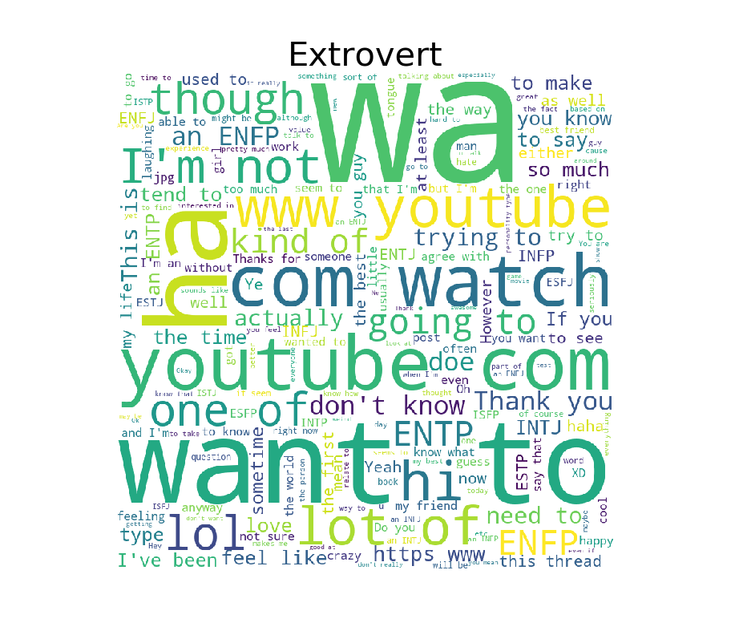
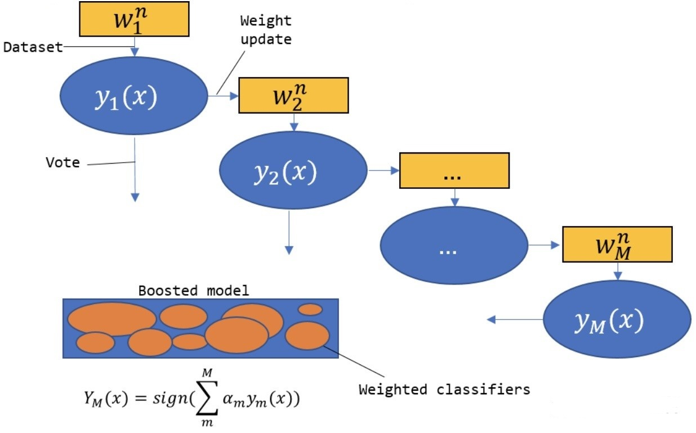
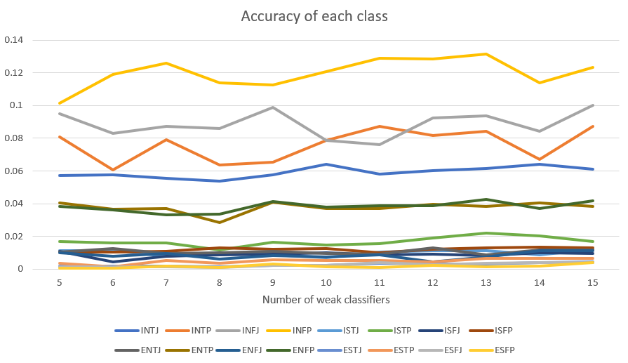
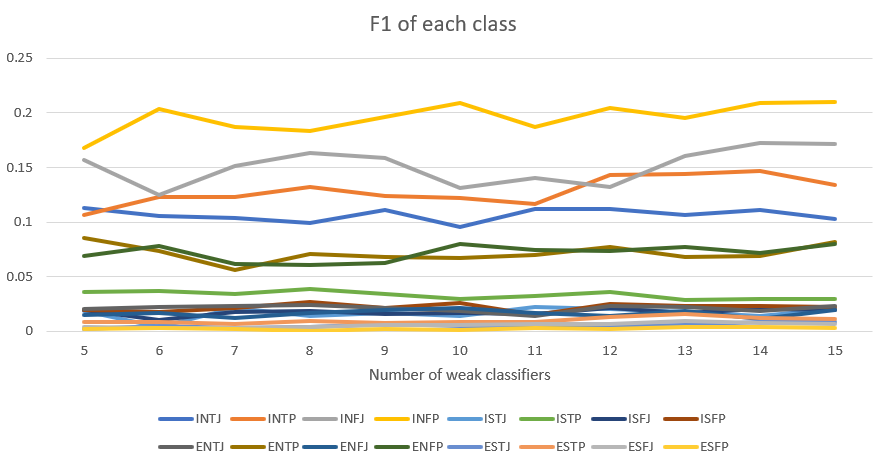
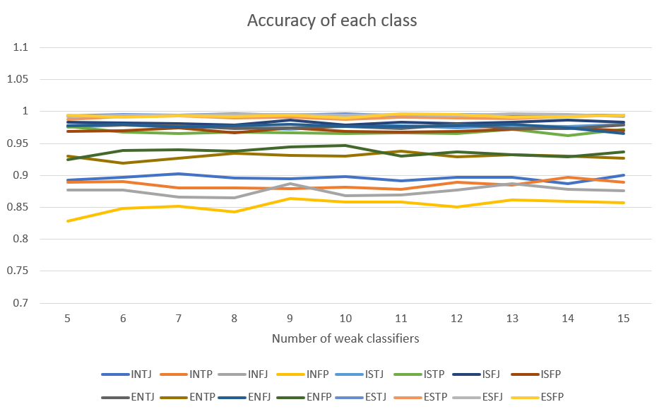
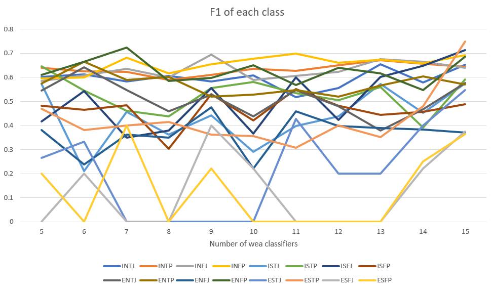
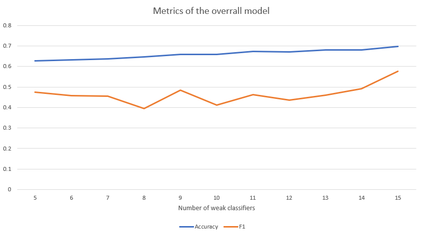

<head>
    <script src="https://cdn.mathjax.org/mathjax/latest/MathJax.js?config=TeX-AMS-MML_HTMLorMML" type="text/javascript"></script>
    <script type="text/x-mathjax-config">
        MathJax.Hub.Config({
            tex2jax: {
            skipTags: ['script', 'noscript', 'style', 'textarea', 'pre'],
            inlineMath: [['$','$']]
            }
        });
    </script>
</head>


# MBTI

# MBTI Text Classification By AdaBoost Model

## Data Preprocessing
### Problem Analysis
The Myers Briggs Type Indicator (or MBTI for short) is a personality type system that divides everyone into 16 distinct personality types across 4 axis:
1. Introversion (I) – Extroversion (E)
2. Intuition (N) – Sensing (S)
3. Thinking (T) – Feeling (F)
4. Judging (J) – Perceiving (P)

So this data set has a total of 16 different tags. In addition to labels, each sample in the data set has a corresponding text, which is the most recent 50 posts records of this person, so it is obviously a multi-class text classification problem, and we must first be clear that whether the text record of the sample is related to his/her personality.

Because personality attributes have 4 dimensions and a total of 16 values, it is not easy to explain the problem if they are fully analyzed. So first select one of the dimensions **1**, and perform word segmentation on the two values I and E in this dimension, then observe whether the result of the word segmentation is related to I and E. In order to explain the problem more intuitively, I made their word cloud graphs for the word segmentation results in the two cases.




It can be seen from these two pictures that for people with **Introversion** personality, the most frequent word is "youtube.com", which may indicate that introverts are more inclined to stay at home to watch videos; in contrast, the **Extroversion** people, though the frequency of  "youtube.com"  is also very large, but there are other high-frequency words, such as "Wa", "want to", these words are inclined to express themselves, so it is very reasonable for **Extroversion** of. So we can be sure that the text of each sample really reflects the personality of the person, then we can use the text as input to predict the personality of the person.

### Vectorize The Text Data
The data set is divided into a training set and a test set according to 8: 2, which are used for training and testing models, respectively.

Because the input data is text data, and the computer cannot understand the text, you need to convert the text data into a vector first. Here we use the classic TFIDF algorithm to convert the corpus into a TFIDF matrix and use it as input data. When generating the TFIDF matrix, some common meaningless stop words can be deleted, which can reduce the input scale and will not cause information loss, thereby improving the efficiency of the model.

```python
# drop the stop words
tfidf = TfidfVectorizer(stop_words='english')
# fit/train the tfidf matrix by train data
tfidf.fit(train_X)
train_X = tfidf.transform(train_X)
test_X = tfidf.transform(test_X)

return train_X, test_X
```

>During the experiment, the program was unable to run because of the TFIDF matrix. I first tried to convert the TFIDF matrix to a numpy array. However, because the TFIDF matrix is a sparse matrix and has a special data structure src_matrix, if it is forced to be converted into a numpy array, you will get a very large matrix, and most of the elements in it are useless information, which causes a surge in data size.

### Vectorize The Label
This is a multi-category classification problem, and the classic algorithms of classification problems are generally aimed at binary classification problems, so it is a very good method to convert the multi-classification problem into a binary classification problem first. Because there are a total of 16 values for tags, theoretically only 15 binary classifiers are needed to completely transform the problem into a binary classification problem, but for coding convenience, I used 16 classifiers to solve.

The original label data is processed to generate 16 new data sets, each targeting 16 types of labels. For example, when targeting the label "INTF", the label with value "INTF" in the original data set is labeled 1, and the rest is labeled -1. This results in a binary classification data set. 

Of course, the multi-label classification problem is a common classification problem. In order to avoid repeating the wheel creation and repeating the above construction of 16 new data sets, sklearn provides an API to solve the multi-label classification problem, **OneVsRestClassifier**, use this API the model can be directly trained without repeatedly constructing a new data set several times.

However, because the experimental task clearly states that each individual category index and the overall index need to be calculated, it is still necessary to train a model for each label.


## AdaBoost Principle
### The Basic Idea Of AdaBoost
Boosting refers to a class of integration methods whose main idea is to boost weak base learners into strong learners. Specific steps are as follows:
1. First train an initial base learner with a training set with equal sample weights;
2. Adjust the weights of the samples in the training set according to the prediction performance of the learner obtained in the previous round (for example, increase the weight of the misclassified samples to make them get more attention in the next round of training), and then train a new one;
3. Repeat **2** until M base learners are obtained, and the final integration result is a combination of M base learners.

It can be seen from this that Boosting algorithm is a serial process. The most famous of the Boosting algorithms is AdaBoost.

Taking the binary classification problem as an example, the method adopted by the AdaBoost (Adaptive Boosting) algorithm is:
1. Increase the weight of samples that were misclassified in the previous round, and reduce the weight of samples that were correctly classified;
2. Linear weighted summation. A base learner with a small error rate has a larger weight, and a base learner with a larger error rate has a smaller weight.

The structure diagram is as follows:
<center>  </center>

### Algorithm Flow
1. Initialize the weights of the samples.
   $$ D_1=(w_{1,1}, w_{1,2},...,w_{1,N}), w_{1,i}=\frac 1 N \tag{1}$$

2. Repeat the following operations to get M base classifier, for m = 1,2,...,M.
   1. According to the sample weight distribution $D_m$ training data to get the $m^{th}$ base classifier $G_m(x)$
   2. Calculate $G_m(x)$ classification error rate on weighted training data set
        $$e_m = \sum_{i=1}^n P(G_m(x_i) \neq y_i) \tag{2}$$
   3. Calculate the coefficient of $G_m(x)$. That is, the weight of the base learner used for the final integration.
        $$\alpha_m = \frac{1}{2} \log{\frac{1-e_m}{e_m}} \tag{3}$$
   4. Update weights of training samples.
        $$D_{m+1} = (w_{m+1,1}, w_{m+1,2},...,w_{m+1,N}) \tag{4}$$
        $$w_{m+1,1} = \frac{w_{m,i}}{Z_m} \exp(-\alpha_m y_i G_m(x_i)), i=1,2,...,N \tag{5}$$
        Where $Z_m$ is the normalization factor, the purpose is to make all the elements of $D_{m+1}$ sum to 1.
        $$Z_m = \sum_{i=1}^n w_{m,i} \exp(-\alpha_m y_i G_m(x_i)) \tag{6}$$
3. Construct the final linear combination of classifiers.
    $$G(x) = sign(\sum_{i=1}^n \alpha_m G_m(x)) \tag{7}$$

### A Simple AdaBoost Implementation In Python
```python
def _fit(self):
    """Train the model, and predict on train dataset and test dataset.
    """        
    for i in range(self.n_estimators):
        # Fit a classifier with the specific weights
        self.weak_clf.fit(self.train_X, self.train_y, sample_weight=self.w)
        pred_train_i = self.weak_clf.predict(self.train_X)
        pred_test_i = self.weak_clf.predict(self.test_X)

        # indicate which sample predict incorrectly, miss[0]==1 indicates that the first sample predict incorrectly
        miss = [int(x) for x in (pred_train_i!=self.train_y)]
        erro_m = np.dot(self.w, miss)

        alpha_m = 0.5 * np.log((1-erro_m) / erro_m)
        # new weights
        miss2 = [x if x==1 else -1 for x in miss]

        self.w = np.multiply(self.w, np.exp([float(x) * alpha_m for x in miss2]))
        self.w = self.w / sum(self.w)

        # Add to prediction
        pred_train_i = [1 if x == 1 else -1 for x in pred_train_i]
        pred_test_i = [1 if x == 1 else -1 for x in pred_test_i]

        self.pred_train = self.pred_train + np.multiply(alpha_m, pred_train_i)
        self.pred_test = self.pred_test + np.multiply(alpha_m, pred_test_i)
```


## Experimental Results
### Metrics
- Calculation of Accuracy  
  For a binary classification problem, all predictions have the following four types:
  1. Trule predicted as a positive example：TP
  2. Truly predicted as a negative example：TN
  3. Falsely predicted as a positive example：FP
  4. Falsely predicted as a negative example：FN

   **Accuracy**：The proportion predicted to be correct
    $$P = \frac{TP+TN}{TP+TN+FP+FN}$$
- Calculation of F1 value  
  For the binary classification problem, to calculate F1, the recall rate must be calculated first.

  **Recall**：
    $$R = \frac{TP}{TP+FN}$$

  **F1**:
    $$F1 = \frac{2PR}{P+R}$$

    For the multi-label classification problem, the Macro-average method is adopted. The n-classification problem is divided into n binary problems, and the F1 score of each binary problem is calculated. The average value of the n F1 scores is Macro F1.

    **Macro-average**:
    $$Macro\_F1 = \sum_{i=1}^n F1_i$$


### Simple AdaBoost Implemented Myself.
For 16 different labels, train individually on the training set according to the simple AdaBoost implemented above. Calculate the accuracy and F1 value of the model on the training set; then make predictions on the test set and calculate the accuracy and F1 value of the model on the test set.

**Accuracy**:
<center></center>

**F1**:
<center></center>


### AdaBoost In sklearn
For 16 different labels, train individually on the training set according to the sklearn supported AdaBoost. The useage of sklearn API is illustrated below.
```python
def Sklearn_AdaBoost():
    """Use the sklearn libary AdaBoost model to predict. Convert the multi class problem to
    binary class problem.
    """    
    data = pd.read_csv(dataFile_path)
    _train_X, _train_y, _test_X, _test_y = Split_Data_Set(data, TEST_PROPORTION)

    train_X, test_X = Vectorize_X(_train_X, _test_X, 'TFIDF')

    for k in range(NUM_CLASSES):
        train_y, test_y = Vectorize_y(_train_y, _test_y, k)
        # define the AdaBoost model, which uses decision tree as weak classfier.
        model = AdaBoostClassifier(
            DecisionTreeClassifier(max_depth=2, min_samples_split=20, min_samples_leaf=5),
            algorithm="SAMME", n_estimators=N_ESTIMATORS, learning_rate=0.8)

        # train the model
        clf = model.fit(train_X, train_y)

        print(f'category_{k}, {CATEGORIES_[k]} >> train score:', clf.score(train_X, train_y))
        print(f'category_{k}, {CATEGORIES_[k]} >> test score:', clf.score(test_X, test_y))
        print('-'*50)
```

**Accuracy**:
<center></center>

**F1**:
<center></center>

### Direct Multiclass Prediction
Solve the multi-class classification problem, without resorting to using 16 binary classifier.
Here we can use sklearn API **OneVsRestClassifier**.

```python
def Multiclass_AdaBoost():
    """Use sklearn libary OneVsRestClassifier model, to solve the problem as an entirety, without
    resorting to binarize the problem.
    """    
    data = pd.read_csv(dataFile_path)
    _train_X, _train_y, _test_X, _test_y = Split_Data_Set(data, TEST_PROPORTION)

    train_X, test_X = Vectorize_X(_train_X, _test_X, 'TFIDF')
    train_y, test_y = Multiclass_Label(_train_y, _test_y)

    weak_clf = DecisionTreeClassifier(max_depth=2, min_samples_split=20, min_samples_leaf=5)
    model = OneVsRestClassifier(AdaBoostClassifier(weak_clf, algorithm="SAMME", n_estimators=N_ESTIMATORS, learning_rate=0.8))
    clf = model.fit(train_X, train_y)

    print('train score:', clf.score(train_X, train_y))
    print('test score:', clf.score(test_X, test_y))
```

**Metrics**:
<center></center>


# MBTI Text Classification By SVM Model