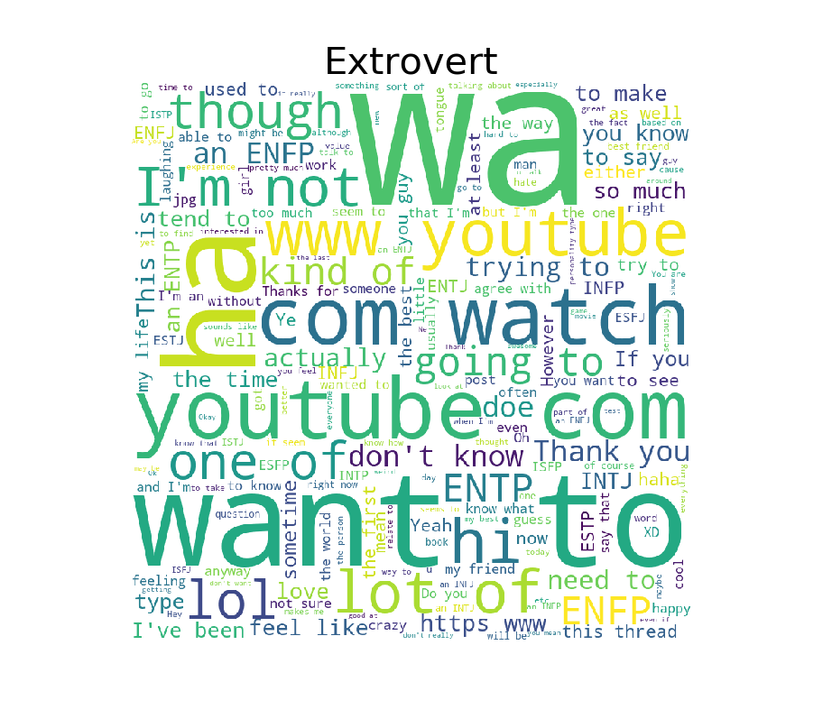
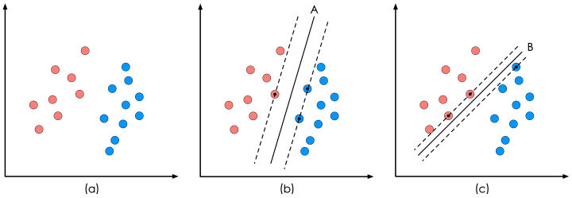
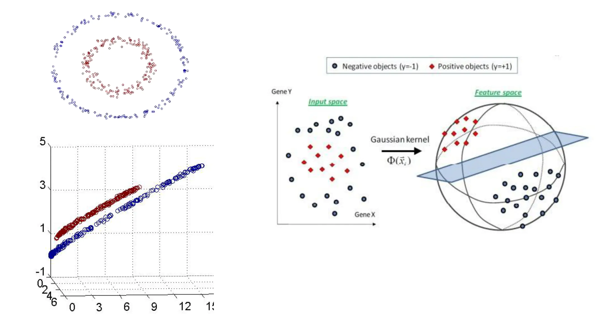
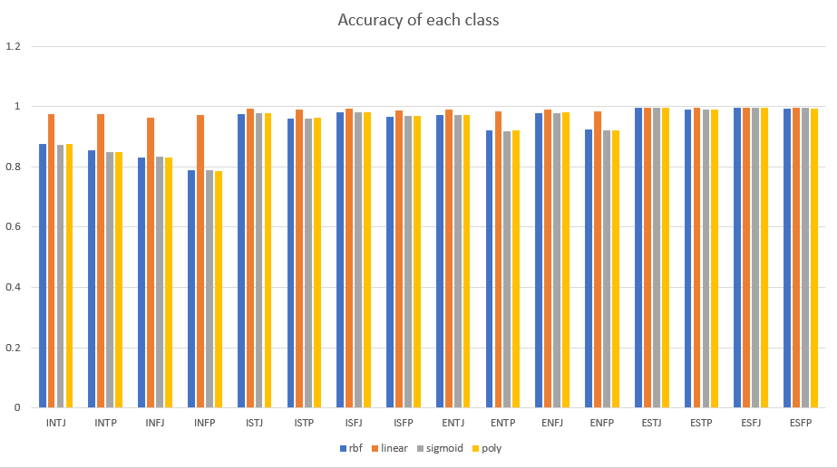
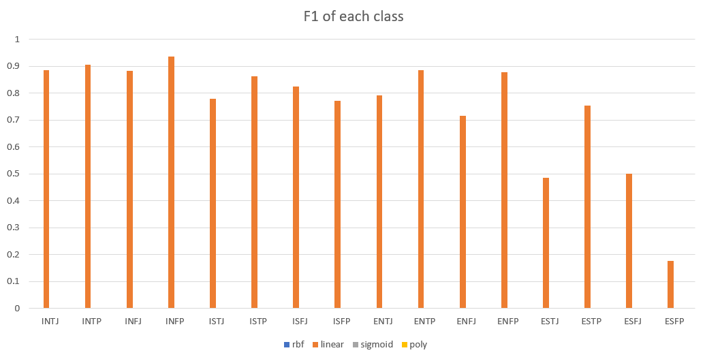
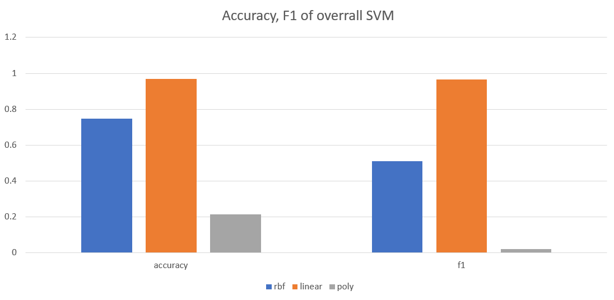

# MBTI Text Classification By SVM

## Data Preprocessing
### Problem Analysis
The Myers Briggs Type Indicator (or MBTI for short) is a personality type system that divides everyone into 16 distinct personality types across 4 axis:
1. Introversion (I) – Extroversion (E)
2. Intuition (N) – Sensing (S)
3. Thinking (T) – Feeling (F)
4. Judging (J) – Perceiving (P)

So this data set has a total of 16 different tags. In addition to labels, each sample in the data set has a corresponding text, which is the most recent 50 posts records of this person, so it is obviously a multi-class text classification problem, and we must first be clear that whether the text record of the sample is related to his/her personality.

Because personality attributes have 4 dimensions and a total of 16 values, it is not easy to explain the problem if they are fully analyzed. So first select one of the dimensions **1**, and perform word segmentation on the two values I and E in this dimension, then observe whether the result of the word segmentation is related to I and E. In order to explain the problem more intuitively, I made their word cloud graphs for the word segmentation results in the two cases.




It can be seen from these two pictures that for people with **Introversion** personality, the most frequent word is "youtube.com", which may indicate that introverts are more inclined to stay at home to watch videos; in contrast, the **Extroversion** people, though the frequency of  "youtube.com"  is also very large, but there are other high-frequency words, such as "Wa", "want to", these words are inclined to express themselves, so it is very reasonable for **Extroversion** of. So we can be sure that the text of each sample really reflects the personality of the person, then we can use the text as input to predict the personality of the person.

### Vectorize The Text Data
The data set is divided into a training set and a test set according to 8: 2, which are used for training and testing models, respectively.

Because the input data is text data, and the computer cannot understand the text, you need to convert the text data into a vector first. Here we use the classic TFIDF algorithm to convert the corpus into a TFIDF matrix and use it as input data. When generating the TFIDF matrix, some common meaningless stop words can be deleted, which can reduce the input scale and will not cause information loss, thereby improving the efficiency of the model.

```python
# drop the stop words
tfidf = TfidfVectorizer(stop_words='english')
# fit/train the tfidf matrix by train data
tfidf.fit(train_X)
train_X = tfidf.transform(train_X)
test_X = tfidf.transform(test_X)

return train_X, test_X
```

>During the experiment, the program was unable to run because of the TFIDF matrix. I first tried to convert the TFIDF matrix to a numpy array. However, because the TFIDF matrix is a sparse matrix and has a special data structure src_matrix, if it is forced to be converted into a numpy array, you will get a very large matrix, and most of the elements in it are useless information, which causes a surge in data size.

### Vectorize The Label
This is a multi-category classification problem, and the classic algorithms of classification problems are generally aimed at binary classification problems, so it is a very good method to convert the multi-classification problem into a binary classification problem first. Because there are a total of 16 values for tags, theoretically only 15 binary classifiers are needed to completely transform the problem into a binary classification problem, but for coding convenience, I used 16 classifiers to solve.

The original label data is processed to generate 16 new data sets, each targeting 16 types of labels. For example, when targeting the label "INTF", the label with value "INTF" in the original data set is labeled 1, and the rest is labeled -1. This results in a binary classification data set. 

Of course, the multi-label classification problem is a common classification problem. In order to avoid repeating the wheel creation and repeating the above construction of 16 new data sets, sklearn provides an API to solve the multi-label classification problem, **OneVsRestClassifier**, use this API the model can be directly trained without repeatedly constructing a new data set several times.

However, because the experimental task clearly states that each individual category index and the overall index need to be calculated, it is still necessary to train a model for each label.


## The Basic Idea of SVM
Consider the binary classification problem, the task of SVM is to maximize the geometric separation between the classification line and the data as much as possible on the premise of correct classification.

<center></center>

The SVM algorithm believes that the classifier b in the above figure is superior to the classifier c in performance, based on the classification interval of b being greater than c.

The points of each class cloest to the hyper plane are called "suport vector", the basic idea of SVM is to maximize the distance from suport vector to the hyper plane. That is, maximize $d$:
$$d = \frac{|\omega^T x_i + \gamma|}{||\omega||}$$

Conventionally, transform the problem to minimize $||\omega||$. Mathematical description of linear SVM optimization problem:

$$min_{\omega,\gamma} \frac{1}{2} ||\omega||^2$$
$$s.t.\ y_i(\omega^T x_i + \gamma) \geq 1,\ i=1,2,...,m$$

The above equation describes a typical quadratic function optimization problem under inequality constraints, and it is also a basic mathematical model of SVM. How to use optimization techniques to solve this problem is beyond the scope of my knowledge, and there are many valuable articles on the Internet, so I will not make formula derivation here.

The above formula is based on the premise that the data is perfectly linearly separable. But in reality, this is impossible, because there will always be errors. In order to solve this problem, SVM added two concepts of soft interval and kernel function.


### Soft Interval
Specifically, the hard-interval SVM requires that all samples are correctly divided by the optimal hyperplane, while the soft-interval SVM allows certain sample points not to satisfy the condition that the interval is greater than or equal to 1. Of course, when maximizing the interval, the number of samples that do not satisfy the inequality should be limited to as few as possible. So we introduce a penalty coefficient $C$ and a relaxation variable $\xi_i$ for each sample point.

Then the mathematical description is:

$$min_{\omega,\gamma,\xi} \frac{1}{2} ||\omega||^2 + \sum_{i=1}^l \xi_i$$
$$s.t.\ y_i(\omega^T x_i + \gamma) \geq 1-\xi_i,\ \xi_i\geq0,\ i=1,2,...,m$$

$$\xi_i = max(0, 1 - y(\omega^Tx+\gamma))$$


### Kernel Function
If the data is completely linearly indivisible, then the soft interval method will also fail. So our task is to project the data into a linearly separable space and then find the hyperplane in that space.

<center></center>

Definition of kernel function:
$$K(x,y) = \phi(x) \cdot \phi(y)$$

The mapping function $\phi(x)$ is to map the data in the low-dimensional space to the high-dimensional space. The kernel function $K(x,y)$ represents the dot product of the two vectors in the high-dimensional space after the mapping.

When the kernel function solves the non-linear problem, the way to adopt is to use the calculation on the low-dimensional feature space to avoid the horrible calculation of the inner product of the vector in the high-dimensional feature space; that is to say, the SVM model has the advantage of linear division of data in the dimensional feature space, while avoiding introduction the terrible inner product calculation in high-dimensional feature space.


## Experimental Results
### Metrics
- Calculation of Accuracy  
  For a binary classification problem, all predictions have the following four types:
  1. Trule predicted as a positive example：TP
  2. Truly predicted as a negative example：TN
  3. Falsely predicted as a positive example：FP
  4. Falsely predicted as a negative example：FN

   **Accuracy**：The proportion predicted to be correct
    $$P = \frac{TP+TN}{TP+TN+FP+FN}$$
- Calculation of F1 value  
  For the binary classification problem, to calculate F1, the recall rate must be calculated first.

  **Recall**：
    $$R = \frac{TP}{TP+FN}$$

  **F1**:
    $$F1 = \frac{2PR}{P+R}$$

    For the multi-label classification problem, the Macro-average method is adopted. The n-classification problem is divided into n binary problems, and the F1 score of each binary problem is calculated. The average value of the n F1 scores is Macro F1.

    **Macro-average**:
    $$Macro\_F1 = \sum_{i=1}^n F1_i$$


### SVM For Each Class Individually
For 16 different labels, train individually on the training set according to SVM. Calculate the accuracy and F1 value of the model on the training set; then make predictions on the test set and calculate the accuracy and F1 value of the model on the test set.

```python
def SVM():
    """Use the sklearn libary SVM model to predict. Convert the multi class problem to
    binary class problem.
    """  
    data = pd.read_csv(dataFile_path)
    _train_X, _train_y, _test_X, _test_y = Split_Data_Set(data, TEST_PROPORTION)

    train_X, test_X = Vectorize_X(_train_X, _test_X, 'TFIDF')

    for k in range(NUM_CLASSES):
        train_y, test_y = Vectorize_y(_train_y, _test_y, k)

        # define SVM model
        model = svm.SVC(decision_function_shape='ovr', kernel='linear')
        # train the model
        clf = model.fit(train_X, train_y)

        train_pred = clf.predict(train_X)
        test_pred = clf.predict(test_X)

        print(accuracy_score(train_y, train_pred))
        print(f1_score(train_y, train_pred, pos_label=1, average='binary'))
```

**Accuracy** of each class with different kernel functions:
<center></center>

**F1** of each class with different kernel functions:
<center></center>


### Overall SVM
For 16 different labels, train individually on the training set according to the sklearn supported AdaBoost. The useage of sklearn API is illustrated below.

```python
def Multiclass_SVM():
    """Use sklearn libary OneVsRestClassifier model, to solve the problem as an entirety, without
    resorting to binarize the problem.
    """ 
    data = pd.read_csv(dataFile_path)
    _train_X, _train_y, _test_X, _test_y = Split_Data_Set(data, TEST_PROPORTION)

    # vectorization
    train_X, test_X = Vectorize_X(_train_X, _test_X, 'TFIDF')
    train_y, test_y = Multiclass_Label(_train_y, _test_y)

    # define SVM model
    model = svm.SVC(decision_function_shape='ovr', kernel='linear')
    # model = OneVsRestClassifier(svm.SVC(kernel='linear'))

    # train the model
    clf = model.fit(train_X, train_y)

    train_pred = clf.predict(train_X)
    test_pred = clf.predict(test_X)

    print(accuracy_score(train_y, train_pred))
    print(f1_score(train_y, train_pred, average='macro'))
```

**Accuracy and F1** of overall SVM with different kernel functions::
<center></center>


## Conclusion
Observe the classifier for each category separately, because the multi-classification problem is converted into a two-class problem, so on average, even if all the samples are predicted to be -1, the accuracy rate is as high as $\frac{15}{16}$, so the reference value of this metric is not so great. And as we can see, the accuracies of every individual classifier with different kernel function are very high and are similar. 

Therefore, focus on the F1 value of the model. F1 refers to the proportion of positive samples that are correctly predicted to all positive samples in the data set. Therefore, the F1 value is concerned with the model's ability to accurately predict a specific label among 16 types of labels.

As can be seen from the diagrams of F1 values of each category, the SVM model with kernel function "rbf", "poly" and "sigmoid" performs so bad on the metric F1, while the SVM model with kernel function "linear" has a very high F1 of each class. As mentioned above, kernel function is to map the input data to higher dimention space. Linear kernel actually is the original function, that is, do not map the input data, while "rbf" is the famous Gaussian Kernel. They perform so differently, so we can conclude that the kernel function of SVM is a very important, pivotal composition.  
As the linear kernel performs well, while the Gaussian Kernel performs bad, it can be conjectured that the input data is linearly separable. The SVM can classify different class samples in the original space, and mapping to the higher dimention space will introduce useless infomation and error.

It can be seen from the diagram of the overall model, model with linear kernel performs well on accuracy and F1, this is consistent with the individual classifier of each class. High accuracy and high F1 manifest that linear kernel is the best solution for MBTI problem.