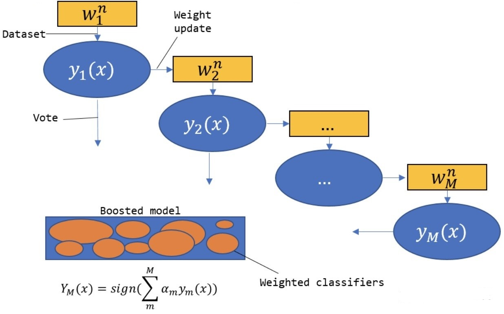

<!-- <script type="text/javascript" src="http://cdn.mathjax.org/mathjax/latest/MathJax.js?config=TeX-AMS-MML_HTMLorMML"></script>
<script type="text/x-mathjax-config">
    MathJax.Hub.Config({ tex2jax: {inlineMath: [['$', '$']]}, messageStyle: "none" });
</script> -->


# MBTI Text Classification By AdaBoost Model

## 数据预处理
### 问题分析
The Myers Briggs Type Indicator (or MBTI for short) is a personality type system that divides everyone into 16 distinct personality types across 4 axis:
1. Introversion (I) – Extroversion (E)
2. Intuition (N) – Sensing (S)
3. Thinking (T) – Feeling (F)
4. Judging (J) – Perceiving (P)

所以这个数据集总共有16种不同的标签。除了标签以外，数据集中每一个样本有一段对应的文本，是这个人最近的50条动态的文字记录，所以很显然这是一个多类的文本分类问题，而我们首先要明确的是，每一个样本的文字记录是否与其性格有关。

因为性格属性有4个维度，共16种取值，所以如果全面分析的话并不容易说明问题。于是先挑选其中一个维度1，对该维度上的两种取值I、E 分别作分词处理，观察分词结果是否与I、E相关。为了更直观地说明问题，我分别对两种情况下的分词结果作出它们的词云图。
<!-- {:height witdth} -->


从这两张图片中可以看出来，对于Introversion性格的人，词频最大的是youtube.com，这有可能表明了内向的人更倾向于呆在家里看视频；反观Extroversion的人，这类人的词云图中youtube.com的频率也很大，但是还出现了其他一些高频词，如"Wa", "want to"，这些词语都是倾向于表达自己的，所以对于Extroversion的人是很合理的。所以我们可以确定每个样本的文本确确实实是可以体现出这个人的性格的，所以我们可以使用文本作为输入来预测人的性格。

### Vectorize The Text Data
因为输入数据是文本数据，而计算机是理解不了文本的，所以需要先将文本数据转化为向量。这里我们使用经典的TFIDF算法，把语料库转化成一个TFIDF矩阵，把TFIDF作为输入数据。在产生TFIDF矩阵时，可以将一些常见的无意义的停用词删除，这样可以减少输入规模，并且不会造成信息丢失，从而提高模型的效率。
```python
# drop the stop words
tfidf = TfidfVectorizer(stop_words='english')
# fit/train the tfidf matrix by train data
tfidf.fit(train_X)
train_X = tfidf.transform(train_X)
test_X = tfidf.transform(test_X)

return train_X, test_X
```
>在实验过程中，曾经因为TFIDF矩阵使得程序无法运行。我一开始尝试把TFIDF矩阵转化为numpy array，然而因为TFIDF矩阵是一个稀疏矩阵，有专门的数据结构src_matrix，如果强行转化为numpy array就会得到一个规模非常庞大的矩阵，并且矩阵的多数元素都是无用信息，这样就造成数据规模激增。

### Vectorize The Label
这是一个多类的分类问题，而分类问题经典的算法一般都是针对二分类问题的，所以先把多分类问题转化成二分类问题是一个很不错的方法。因为标签总共有16个取值，所以理论上只需要15个而二分类器就能把问题完全地转化为二分类问题，但是为了编码方便，我使用了16个分类器来解决。

对原始的标签数据进行处理，产生新的16个数据集，分别针对16种标签。例如，当针对标签“INTF”时，把原始数据集中标签值为“INTF”的标为1，其余标为-1，这样就得到一个二分类的数据集，用这个数据集训练出来的模型就是针对标签“INTF”的二分类器。

同理，针对其他标签值时进行相同的处理，最后可以得到16个新的数据集，以及16个二分类器。

当然，多标签的分类问题作为常见的分类问题，为了避免重复造轮子，重复上述的构建16个新的数据集，sklearn提供了解决多标签分类问题的API, **OneVsRestClassifier**，使用这个API可以直接训练模型，而不用重复构造若干次新的数据集。

但是，因为实验任务中明确写着需要计算每一个单独的类别的指标、以及整体的指标，所以还是很有必要为每一种标签训练一个模型。而整体的指标则用 **OneVsRestClassifier** 得到的模型来计算。


## AdaBoost原理
### AdaBoost的基本思想
Boosting指的是一类集成方法，其主要思想就是将弱的基学习器提升(boost)为强学习器。具体步骤如下:
1. 先用每个样本权重相等的训练集训练一个初始的基学习器；
2. 根据上轮得到的学习器对训练集的预测表现情况调整训练集中的样本权重(例如提高被错分类的样本的权重使之在下轮训练中得到更多的关注), 然后据此训练一个新的基学习器；
3. 重复2直到得到 M 个基学习器，最终的集成结果是 M 个基学习器的组合。
由此看出，Boosting算法是一个串行的过程。Boosting算法簇中最著名的就是AdaBoost。

以二分类问题为例，AdaBoost(Adaptive Boosting, 自适应增强)算法采取的方法是:
1. 提高上一轮被错误分类的样本的权值，降低被正确分类的样本的权值；
2. 线性加权求和。误差率小的基学习器拥有较大的权值，误差率大的基学习器拥有较小的权值。

结构图如下：
<div align=center>
    
</div>

### 算法步骤
1. Initialize the weights of the samples.
   $$ D_1=(w_{1,1}, w_{1,2},...,w_{1,N}), w_{1,i}=\frac 1 N \tag{1}$$

2. Repeat the following operations to get M base classifier, for m = 1,2,...,M.
   1. According to the sample weight distribution $D_m$ training data to get the $m^{th}$ base classifier $G_m(x)$
   2. Calculate $G_m(x)$ classification error rate on weighted training data set
        $$e_m = \sum_{i=1}^n P(G_m(x_i) \neq y_i) \tag{2}$$
   3. Calculate the coefficient of $G_m(x)$. That is, the weight of the base learner used for the final integration.
        $$\alpha_m = \frac{1}{2} \log{\frac{1-e_m}{e_m}} \tag{3}$$
   4. Update weights of training samples.
        $$D_{m+1} = (w_{m+1,1}, w_{m+1,2},...,w_{m+1,N}) \tag{4}$$
        $$w_{m+1,1} = \frac{w_{m,i}}{Z_m} \exp(-\alpha_m y_i G_m(x_i)), i=1,2,...,N \tag{5}$$
        Where $Z_m$ is the normalization factor, the purpose is to make all the elements of $D_{m+1}$ sum to 1.
        $$Z_m = \sum_{i=1}^n w_{m,i} \exp(-\alpha_m y_i G_m(x_i)) \tag{6}$$
3. Construct the final linear combination of classifiers.
    $$G(x) = sign(\sum_{i=1}^n \alpha_m G_m(x)) \tag{7}$$

### A Simple AdaBoost Implementation In Python
```python
def _fit(self):
    """Train the model, and predict on train dataset and test dataset.
    """        
    for i in range(self.n_estimators):
        # Fit a classifier with the specific weights
        self.weak_clf.fit(self.train_X, self.train_y, sample_weight=self.w)
        pred_train_i = self.weak_clf.predict(self.train_X)
        pred_test_i = self.weak_clf.predict(self.test_X)

        # indicate which sample predict incorrectly, miss[0]==1 indicates that the first sample predict incorrectly
        miss = [int(x) for x in (pred_train_i!=self.train_y)]
        erro_m = np.dot(self.w, miss)

        alpha_m = 0.5 * np.log((1-erro_m) / erro_m)
        # new weights
        miss2 = [x if x==1 else -1 for x in miss]

        self.w = np.multiply(self.w, np.exp([float(x) * alpha_m for x in miss2]))
        self.w = self.w / sum(self.w)

        # Add to prediction
        pred_train_i = [1 if x == 1 else -1 for x in pred_train_i]
        pred_test_i = [1 if x == 1 else -1 for x in pred_test_i]

        self.pred_train = self.pred_train + np.multiply(alpha_m, pred_train_i)
        self.pred_test = self.pred_test + np.multiply(alpha_m, pred_test_i)
```


## Ablation experiment


- AdaBoost原理和实现 ——— https://zhuanlan.zhihu.com/p/59121403
- word2vec —— https://blog.csdn.net/huacha__/article/details/84068653
- word2vec python interface —— https://github.com/danielfrg/word2vec
- cross-value-score —— https://blog.csdn.net/qq_22592457/article/details/103584053